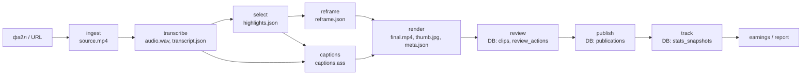

# Архитектура

Local-first монолит с жёсткими границами. Три независимые оси: **оркестрация** (pipeline, очередь) ≠ **вычисления** (backends: whisper, LLM, лица, энкодер) ≠ **хранение** (ObjectStorage + SQLite).

## Слои

| Слой | Модули | Правило |
|---|---|---|
| Интерфейсы | `cli.py`, `bot/` | тонкие, вызывают сервисы, не трогают ffmpeg и SQL |
| Сервисы | `services.py`, `worker.py` | сборка зависимостей, создание job, ревью, публикация |
| Pipeline | `pipeline/*` | этапы `run(ctx) -> StageResult`, только через контракты `schemas.py` |
| Бэкенды | `backends/*`, `publish/*` | внешний мир за `Protocol`; в тестах — fake |
| Медиа | `media/*` | единственное место вызова ffmpeg/ffprobe |
| Хранение | `storage/*`, `db.py` | артефакты по ключам; метаданные в SQLite |
| Очередь | `queue/*` | Inline (dev/test), RQ (prod); этапы не знают про rq |

## Поток данных

## Ключевые контракты

- `ObjectStorage` (`storage/base.py`), `Queue` (`queue/base.py`), `Transcriber`, `LLMProvider`, `FaceDetector`, `EncoderBackend` (`backends/*/base.py`) — `typing.Protocol`.
- `WorkerCapabilities` / `TaskRequirements` (`compute/capabilities.py`) — задачи описывают требования; сегодня всё выполняется локально.
- Все данные между этапами — модели `schemas.py`, сериализуются в JSON-артефакты.
